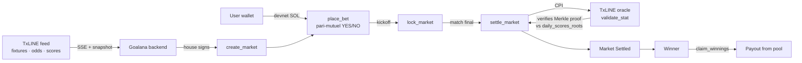

# Goalana ⚽ — World Cup markets that settle themselves

> **Trustless World Cup prediction markets on Solana, priced and settled from [TxLINE](https://txline.txodds.com) (TxODDS' verifiable sports feed).**
> No admin decides the winner — a TxLINE Merkle proof is verified **on-chain, inside the settlement transaction**. A wrong proof reverts the transaction, so the money can only move on a proof the oracle program itself accepts.

Built for the **TxODDS × Superteam** _Prediction Markets & Settlement_ track.

[](https://explorer.solana.com/address/AgxqK6wRkFKyabyArNiJF8dpoJ6TNLLxPnV5rg27pRQu?cluster=devnet)
[](https://txline.txodds.com)
[](https://www.anchor-lang.com/)
[](#testing--evidence)

**🎬 Demo:** _[add Loom/YouTube link]_ · **🔗 Live app:** _[add Vercel link]_ · **⛓ Program:** [`AgxqK6…7pRQu`](https://explorer.solana.com/address/AgxqK6wRkFKyabyArNiJF8dpoJ6TNLLxPnV5rg27pRQu?cluster=devnet)

---

## Why Goalana is different

Every project in this track says "trustless settlement." Few make it **visible**. Goalana's differentiator is that the proof is inspectable in the product: you can watch a market resolve, see the exact TxLINE Merkle proof that settled it, and click through to the on-chain `settle_market` CPI on Explorer.

| Approach | Who decides the outcome | Goalana's difference |
|---|---|---|
| Token-voted markets | Voters / dispute rounds | A signed Merkle proof, not a vote. |
| Off-chain resolver | A script pushes the answer later | The proof is verified **in the same tx that settles**. |
| Oracle-feed relay | Feed is trusted, then relayed | We **CPI into TxLINE's own oracle program** and it verifies the proof against its anchored daily root. |
| "Mock CPI" demos | No real proof is checked | Real CPI into the live devnet TxLINE oracle, with a 26-test suite incl. tampered-proof rejection. |

---

## How a market resolves



1. **Create** — the house opens on-chain markets for a real TxLINE World Cup fixture (`competitionId 72`). Creation is **house-only by design** (see [non-goals](docs/PRD.md#non-goals-this-hackathon)).
2. **Bet** — anyone stakes devnet SOL into a **pari-mutuel** YES/NO pool. Odds shown are the live TxLINE reference probability (clearly labelled; the pool price is separate).
3. **Lock** — betting closes at kickoff; the pool is frozen on-chain.
4. **Settle** — once the match is final, `settle_market` fetches TxLINE's three-stage Merkle proof and **CPIs into TxLINE's oracle `validate_stat`**, which verifies the proof against its on-chain `daily_scores_roots` account. A bad/stale/tampered proof reverts the whole transaction.
5. **Claim** — winners pull their share of the pool; if a side has no counter-liquidity or a market is cancelled, stakes are refundable.

---

## On-Chain Evidence — verify it yourself (Devnet)

Real transactions on Solana Devnet. Append `?cluster=devnet` is already included in the links.

| What | Address / Signature |
|---|---|
| **Goalana program** | [`AgxqK6wRkFKyabyArNiJF8dpoJ6TNLLxPnV5rg27pRQu`](https://explorer.solana.com/address/AgxqK6wRkFKyabyArNiJF8dpoJ6TNLLxPnV5rg27pRQu?cluster=devnet) |
| **TxLINE oracle** (CPI target) | [`6pW64gN1s2uqjHkn1unFeEjAwJkPGHoppGvS715wyP2J`](https://explorer.solana.com/address/6pW64gN1s2uqjHkn1unFeEjAwJkPGHoppGvS715wyP2J?cluster=devnet) |
| `create_market` — France v England, FULL_TIME_HOME_WIN (fixture `18257865`) | [tx `g5ErxKVH…tZRq1n`](https://explorer.solana.com/tx/g5ErxKVHGdGCwwqapzfj3SB9AR9kZ5p3FW8sxESiLRek938iYayGPio8NLTpLY5gotDRbQaaZvJCAhxF3tZRq1n?cluster=devnet) |
| Market PDA (same market) | [`GRzRon4Pf3SQUjQL61LPCxE5fmpRX1qmz1E1vZpmTwfz`](https://explorer.solana.com/address/GRzRon4Pf3SQUjQL61LPCxE5fmpRX1qmz1E1vZpmTwfz?cluster=devnet) |
| `place_bet` — real 0.05 SOL YES stake | [tx `5KNNajkr…SykNpYq`](https://explorer.solana.com/tx/5KNNajkrmw51Gas72vR9KaeB42TK3pW3xpbcyokk3cW9tzTqErM5m2Q8NRFZc57i59UJ2vpVyu9kU3iPwSykNpYq?cluster=devnet) |
| Vault PDA (escrow, created lazily on first bet) | [`3wHApPpeqVaQnYW8bsNFtJmqg4qgH2jSM43dkf3iwovf`](https://explorer.solana.com/address/3wHApPpeqVaQnYW8bsNFtJmqg4qgH2jSM43dkf3iwovf?cluster=devnet) |
| On-chain lifecycle test suite | **26 / 26 passing** (localnet, controllable clock) — see [Testing](#testing--evidence) |

**Honest status:** `create_market` / `place_bet` / `lock_market` / `cancel_market` / `claim_refund` are validated on **live Devnet** with real transactions (above). Full `settle_market` + `claim_winnings` are validated end-to-end on **localnet** (26/26, including the CPI Merkle path and tampered-proof rejection); live-Devnet settlement is positioned to fire automatically when the France v England semifinal finishes (2026-07-18). We label what ran where rather than overclaim — see [`todo.md`](./todo.md) for the full validation log.

---

## TxLINE integration

TxLINE is the **primary and only** data source — remove it and there are no fixtures, no odds, and nothing to settle.

| Endpoint | Used for | Where |
|---|---|---|
| `POST /auth/guest/start` | Guest JWT auth | `packages/txline` auth |
| On-chain `subscribe` + `POST /api/token/activate` | Free-tier subscription + API token | activation script |
| `GET /fixtures/snapshot` (competition `72`) | Real World Cup schedule → markets | fixtures worker |
| `GET /odds/snapshot` + `GET /odds/stream` (SSE) | Reference odds → market pricing + movement chart | `odds.worker.ts` |
| `GET /scores/snapshot` + `GET /scores/stream` (SSE) | Live scores, event timeline, final-state detection | `scorer.worker.ts` |
| `GET /scores/stat-validation` | **Three-stage Merkle proof** for on-chain settlement | `settlement.service.ts` |
| On-chain `validate_stat` **CPI** | Trustless outcome verification | `settle_market.rs` / `txline_cpi.rs` |

Full detail: [`docs/TXLINE.md`](docs/TXLINE.md).

---

## Architecture

```text
apps/web              Next.js frontend (fixtures, markets, betting, settlement proof)
apps/api              Express backend — TxLINE ingestion (SSE), crons, workers, on-chain calls
packages/db           Prisma schema (PostgreSQL)
packages/txline       TxLINE API client (auth, fixtures, odds, scores + SSE)
packages/goalana-sdk  TypeScript SDK for the Goalana Anchor program (typed PDAs)
packages/ui           shared shadcn/ui components
goalana_program       Anchor workspace — the on-chain program (Rust)
```

The on-chain program: `create_market` → `place_bet` → `lock_market` → `settle_market` (CPI into TxLINE, Merkle proof verified against `daily_scores_roots`) → `claim_winnings` / `claim_refund`. The **Market PDA itself escrows the pooled SOL** via a Vault PDA; payouts debit it with signer seeds. Deep dive: [`docs/ARCHITECTURE.md`](docs/ARCHITECTURE.md), [`docs/MARKET_LIFECYCLE.md`](docs/MARKET_LIFECYCLE.md).

---

## Quick start

Monorepo (Turborepo + bun). From the repo root:

```bash
bun install
bun run typecheck        # 6/6 packages clean
turbo run dev            # apps/web on :3000, apps/api on :8081
```

Backend needs a Postgres URL and TxLINE credentials — see [`.env.example`](./.env.example) and [`docs/DEPLOYMENT.md`](docs/DEPLOYMENT.md). World Cup is competition `72`; the `COMPETITION_ID` validation-mode fallback is explained in the [Validation mode](#validation-mode) note below.

### On-chain program

```bash
cd goalana_program
anchor build
anchor test               # 26 lifecycle tests on a local validator
anchor deploy --provider.cluster devnet
```

---

## Testing & evidence

- **26 / 26 on-chain lifecycle tests** (`goalana_program/tests/`, `anchor test`), with real balance-diff assertions — not just status checks. Coverage includes:
  - `settle_market`: real outcome=true / outcome=false via the CPI, **plus rejection of** stale oracle timestamp (`StaleOracleSnapshot`), wrong fixture id, wrong stat key, wrong daily-root PDA, already-settled, and cancelled market — i.e. the **custom check gate** the track's bonus asks for.
  - `claim_winnings`: 3-user proportional payout, double-claim rejected (`AlreadyClaimed`), losing-side rejected (`NoWinningStake`).
  - `claim_refund`: cancelled-market and empty-winning-pool paths.
- **Live-Devnet** create/bet/lock/cancel/refund validated with the real transactions in the [evidence table](#on-chain-evidence--verify-it-yourself-devnet).
- **Backend + monorepo** typecheck clean across all packages.

---

## Docs

The real, audited documentation lives in [`docs/`](./docs) (reflects a code audit, not aspirational design):

- [`docs/PRD.md`](docs/PRD.md) — problem, scope, MVP features, non-goals
- [`docs/ARCHITECTURE.md`](docs/ARCHITECTURE.md) — monorepo, data flow, account model
- [`docs/TXLINE.md`](docs/TXLINE.md) — TxLINE auth, endpoints, on-chain Merkle-proof CPI
- [`docs/MARKET_LIFECYCLE.md`](docs/MARKET_LIFECYCLE.md) — the 9-step lifecycle, per-step status
- [`docs/API.md`](docs/API.md) — backend endpoints
- [`docs/DEPLOYMENT.md`](docs/DEPLOYMENT.md) — manual VM deployment for `apps/api`
- [`todo.md`](./todo.md) — dated validation log with tx evidence

### Validation mode

World Cup (TxLINE competition `72`) **is the product** — not a multi-competition pivot. `apps/api/src/config/competition.ts`'s `getActiveCompetitionId()` keeps World Cup active as long as it has an upcoming fixture, and only falls back to the soonest-upcoming alternative in the free-tier bundle (e.g. Friendlies `430`) as Devnet-validation continuity if World Cup stalls inside the judging window. Reset with `COMPETITION_ID=72` or unset it.

---

## TxLINE API feedback

**Liked most**

- One normalized JSON schema across fixtures / odds / scores made mapping to markets straightforward.
- The three-stage `stat-validation` proof with an on-chain anchored daily root is a genuinely strong settlement primitive — exactly what a trustless engine needs.
- Guest-JWT + `X-Api-Token` two-token auth and the World Cup free tier are low-friction.

**Friction**

- The exact byte/serialization layout of the on-chain `validate_stat` args (FixtureSummary / Predicate / StatProof) wasn't obvious from the prose docs — a copy-paste Anchor CPI example would have removed the biggest unknown.
- `GameState` is always `"scheduled"` in the feed, so live/finished has to be derived from `StatusId` + kickoff age + feed freshness.
- Odds aren't priced until close to kickoff, which makes early-window market creation for far-out fixtures a waiting game.

---

_Devnet only. Not real-money wagering — stakes are valueless devnet SOL._
