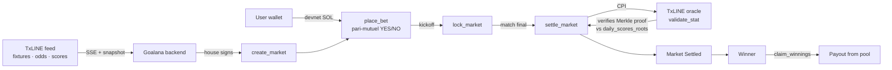

# Goalana ⚽ — World Cup markets that settle themselves

> **Trustless World Cup prediction markets on Solana, priced and settled from [TxLINE](https://txline.txodds.com) (TxODDS' verifiable sports feed).**
> No admin decides the winner — a TxLINE Merkle proof is verified **on-chain, inside the settlement transaction**. A wrong proof reverts the transaction, so the money can only move on a proof the oracle program itself accepts.

Built for the **TxODDS × Superteam** _Prediction Markets & Settlement_ track.

[](https://explorer.solana.com/address/AgxqK6wRkFKyabyArNiJF8dpoJ6TNLLxPnV5rg27pRQu?cluster=devnet)
[](https://txline.txodds.com)
[](https://www.anchor-lang.com/)
[](#testing--evidence)

**🎬 Demo:** _[add Loom/YouTube link]_ · **🔗 Live app:** _[add Vercel link]_ · **⛓ Program:** [`AgxqK6…7pRQu`](https://explorer.solana.com/address/AgxqK6wRkFKyabyArNiJF8dpoJ6TNLLxPnV5rg27pRQu?cluster=devnet)

---

## Why Goalana is different

Every project in this track says "trustless settlement." Few make it **visible**. Goalana's differentiator is that the proof is inspectable in the product: you can watch a market resolve, see the exact TxLINE Merkle proof that settled it, and click through to the on-chain `settle_market` CPI on Explorer.

| Approach | Who decides the outcome | Goalana's difference |
|---|---|---|
| Token-voted markets | Voters / dispute rounds | A signed Merkle proof, not a vote. |
| Off-chain resolver | A script pushes the answer later | The proof is verified **in the same tx that settles**. |
| Oracle-feed relay | Feed is trusted, then relayed | We **CPI into TxLINE's own oracle program** and it verifies the proof against its anchored daily root. |
| "Mock CPI" demos | No real proof is checked | Real CPI into the live Devnet TxLINE oracle (see [Proof integrity — a forged proof cannot settle a market](#proof-integrity--a-forged-proof-cannot-settle-a-market) below); the 26/26 localnet suite covers Goalana's own guards, not proof verification — see Honest status. |

---

## How a market resolves



1. **Create** — the house opens on-chain markets for a real TxLINE World Cup fixture (`competitionId 72`). Creation is **house-only by design** (see [non-goals](docs/PRD.md#non-goals-this-hackathon)).
2. **Bet** — anyone stakes devnet SOL into a **pari-mutuel** YES/NO pool. Odds shown are the live TxLINE reference probability (clearly labelled; the pool price is separate).
3. **Lock** — betting closes at kickoff; the pool is frozen on-chain.
4. **Settle** — once the match is final, `settle_market` fetches TxLINE's three-stage Merkle proof and **CPIs into TxLINE's oracle `validate_stat`**, which verifies the proof against its on-chain `daily_scores_roots` account. A bad/stale/tampered proof reverts the whole transaction.
5. **Claim** — winners pull their share of the pool; if a side has no counter-liquidity or a market is cancelled, stakes are refundable.

---

## On-Chain Evidence — verify it yourself (Devnet)

Real transactions on Solana Devnet. Append `?cluster=devnet` is already included in the links.

| What | Address / Signature |
|---|---|
| **Goalana program** | [`AgxqK6wRkFKyabyArNiJF8dpoJ6TNLLxPnV5rg27pRQu`](https://explorer.solana.com/address/AgxqK6wRkFKyabyArNiJF8dpoJ6TNLLxPnV5rg27pRQu?cluster=devnet) |
| **TxLINE oracle** (CPI target) | [`6pW64gN1s2uqjHkn1unFeEjAwJkPGHoppGvS715wyP2J`](https://explorer.solana.com/address/6pW64gN1s2uqjHkn1unFeEjAwJkPGHoppGvS715wyP2J?cluster=devnet) |
| `create_market` — France v England, FULL_TIME_HOME_WIN (fixture `18257865`) | [tx `g5ErxKVH…tZRq1n`](https://explorer.solana.com/tx/g5ErxKVHGdGCwwqapzfj3SB9AR9kZ5p3FW8sxESiLRek938iYayGPio8NLTpLY5gotDRbQaaZvJCAhxF3tZRq1n?cluster=devnet) |
| Market PDA (same market) | [`GRzRon4Pf3SQUjQL61LPCxE5fmpRX1qmz1E1vZpmTwfz`](https://explorer.solana.com/address/GRzRon4Pf3SQUjQL61LPCxE5fmpRX1qmz1E1vZpmTwfz?cluster=devnet) |
| `place_bet` — real 0.05 SOL YES stake | [tx `5KNNajkr…SykNpYq`](https://explorer.solana.com/tx/5KNNajkrmw51Gas72vR9KaeB42TK3pW3xpbcyokk3cW9tzTqErM5m2Q8NRFZc57i59UJ2vpVyu9kU3iPwSykNpYq?cluster=devnet) |
| Vault PDA (escrow, created lazily on first bet) | [`3wHApPpeqVaQnYW8bsNFtJmqg4qgH2jSM43dkf3iwovf`](https://explorer.solana.com/address/3wHApPpeqVaQnYW8bsNFtJmqg4qgH2jSM43dkf3iwovf?cluster=devnet) |
| On-chain lifecycle test suite | **26 / 26 passing** (localnet, controllable clock) — see [Testing](#testing--evidence) |

### Proof integrity — a forged proof cannot settle a market

Settlement never trusts Goalana. `settle_market` delegates to TxLINE's oracle by CPI into
`validate_stat`, which re-hashes the Merkle path against a root anchored on-chain. The
transactions below call **that exact instruction with the exact arguments settlement uses**,
against the **real** TxLINE oracle on Devnet — for England 1–2 Argentina (fixture `18241006`).
Rendered in-app under the fixture's **Proof Integrity** tab.

| Case | Proof | Result | Signature |
|---|---|---|---|
| Total goals > 1.5 (keys 1+2) | genuine | ✅ accepted → `YES`, 198,959 CU | [`4uB1JMtx…dpt5GEcA`](https://explorer.solana.com/tx/4uB1JMtxtZEr5K5rDfx2e3n4eXK6tpdaVk6QbCFWqzw7sy4PxvEbZkJ6ozo5TtNkc5e7zBaRA6hpDFoxdpt5GEcA?cluster=devnet) |
| Total corners > 9.5 (keys 7+8) | genuine | ✅ accepted → `NO`, 198,965 CU | [`qMSVSThU…cALVJWi`](https://explorer.solana.com/tx/qMSVSThUULv23wsjNnL2uVBDZt4mq42GcYRVHjU2BcCXN92o2DNPzxqZKxRofd2fofmKnn9QiC34s16fcALVJWi?cluster=devnet) |
| Total yellow cards > 3.5 (keys 3+4) | genuine | ✅ accepted → `YES`, 198,963 CU | [`22r1dJCS…x4vC7T7B`](https://explorer.solana.com/tx/22r1dJCSeX5MzGPWkRNnPnNz2khCj24QsJV35JBQRc5xJdhQkgfUyZLaBxGUXX2TSNi16AC9HeQMhpkGx4vC7T7B?cluster=devnet) |
| Same goals proof, **value forged** 1 → 6 | tampered | ❌ **reverted** — `InvalidStatProof` (6023) | [`2fpwYkGU…d56K74Bb`](https://explorer.solana.com/tx/2fpwYkGU3apxRb5WnvXeXNQ6MGwtuDJZikW53ZfZrLi7k64hC9RRJBHZvh7wZ1cVX1kfsd4dUg47PaGQd56K74Bb?cluster=devnet) |
| Same goals proof, **one sibling-hash byte flipped** | tampered | ❌ **reverted** — `InvalidStatProof` (6023) | [`Zf3XtAxZ…C4HpqX3`](https://explorer.solana.com/tx/Zf3XtAxZtEsZivuvRtHzsfJhS4mHfFmtr5ikzb318v67ukPxb5ScDiXzCjwaRk4iMVvpbyLm8YvVpoRaC4HpqX3?cluster=devnet) |

Two things this shows, neither of them asserted:

1. **Forgery fails.** Change one goal, or one byte of one hash, and the oracle reverts — so the
   CPI fails and `settle_market` reverts with it. A false outcome cannot be settled.
2. **Settlement is stat-agnostic.** Goals, corners and cards all verify through the _identical_
   `add + greaterThan` predicate and the _identical_ instruction; only the stat keys differ.
   Goalana is not a goals oracle — and this is no longer just a claim: France v England carries two
   real **unpriced parametric prop markets**, "Total corners > 9.5" and "Total cards > 3.5"
   ([evidence](#parametric-prop-markets--unpriced-pari-mutuel)), created without any TxLINE
   reference odds (TxLINE prices no corners/cards markets for this competition) — the pari-mutuel
   pool is the only price, and creation for every future fixture is fully automated.

Reproduce: `bun src/scripts/record-proof-integrity.ts <fixtureId> --execute` (from `apps/api`).

### Parametric prop markets — unpriced pari-mutuel

The track brief explicitly suggests parametric prop bets ("Team A Corners + Team B Corners >
10"). TxLINE prices no corners/cards odds for this competition, so instead of a TxLINE-priced
market, these two are **unpriced** — the pari-mutuel pool itself is the only price, labelled
"Unpriced — the pool sets the price" in the UI. Real Devnet markets on France v England
(fixture `18257865`):

| Market | Predicate | Market PDA | `create_market` tx |
|---|---|---|---|
| Total corners > 9.5 | keys 7+8, `add > 9` | [`3S7Qfd5g…5XTDWQtcPU`](https://explorer.solana.com/address/3S7Qfd5goxGV2qWA6nJczd9UsRqPB93Cks5XTDWQtcPU?cluster=devnet) | [`5FqQqH7f…FLe1YZw`](https://explorer.solana.com/tx/5FqQqH7fGiocMwdoLg4d7Q43aZm4xQW9fksXo5GJncfpNjm73R6Q6GKrEGHdvoEa6icX1KLuJX3WS32ViFLe1YZw?cluster=devnet) |
| Total cards > 3.5 | keys 3+4, `add > 3` | [`8nhWLYnw…Veg74iy6x4`](https://explorer.solana.com/address/8nhWLYnwHuhwpoA3ptAzJr1VLb7dQe9iVeWvg74iy6x4?cluster=devnet) | [`5PfBFxKN…kbspXbV`](https://explorer.solana.com/tx/5PfBFxKNrk3JVmXtD1dcMkET3G8EsTH3Tc8oLtagv5A5BaBkenA9MwB8rXKKiGXx7P9GUA3DGwqbP8k9QkbspXbV?cluster=devnet) |

Both settle through the **identical** `settle_market` → `validate_stat` CPI path as every other
market — no special-casing by stat key (see §1 above and `settle_market.rs`). Creation is
automated: `market.service.ts::createParametricPropMarketsForFixture()` runs unconditionally
(independent of any TxLINE odds row) for every fixture the market-discovery cron already
processes, so every future match gets both prop markets with no manual step.

**Honest status:** `create_market` / `place_bet` / `lock_market` / `cancel_market` / `claim_refund` are validated on **live Devnet** with real transactions (above). Merkle verification and tampered-proof rejection are validated on **live Devnet** against TxLINE's real oracle (the table above). Full `settle_market` + `claim_winnings` are exercised end-to-end on **localnet** (26/26) — note that the localnet suite runs against `txoracle_mock`, which returns a canned verdict and does **not** verify Merkle proofs, so it covers Goalana's own guards (stat-key binding, stale-snapshot, PDA derivation, state machine) but proves nothing about proof integrity; that is what the Devnet evidence above is for. Live-Devnet settlement is positioned to fire automatically when the France v England semifinal finishes (2026-07-18). We label what ran where rather than overclaim — see [`todo.md`](./todo.md) for the full validation log.

---

## Built to the track sheet

TxODDS' own **Architectural Considerations** and **Ideas to Get Started** for this track, mapped
directly to what's shipped — so the rubric check doesn't require reading the whole README.

### Architectural considerations

| Requirement | Goalana |
|---|---|
| No P2P transfers of the TxLINE credit token | ✅ All staking is **native devnet SOL** into Goalana's own Vault PDA. The TxLINE token is touched exactly once, for data-authorization (`subscribe` + activate script) — never by users. |
| Permissionless results validation ("unlock funds natively on Solana on other coins than TxLINE") | ✅ SOL escrow in a neutral PDA; `settle_market` requires **no authority signer** — see [House trust surface](./RISKS.md#4-house-trust-surface); claims are user-pulled. |
| Custom On-Chain Settlement Engine via CPI into `validate_stat` | ✅ `settle_market.rs` → `txline_cpi.rs`, plus Goalana's own check gates (stat-key binding, stale-snapshot, PDA derivation) and the [forged-proof revert evidence](#proof-integrity--a-forged-proof-cannot-settle-a-market). |

### Ideas to get started

| Idea | Status | Evidence |
|---|---|---|
| Full-Tournament Auto-Market | ✅ Markets auto-create from fixtures + odds crons, auto-lock at kickoff, auto-settle via CPI — zero manual steps for any fixture the free-tier feed exposes. | `market.cron.ts` → `processMarketsForUpcomingFixtures()` |
| Verifiable Resolution UI | ✅ **Our headline.** Settlement proof receipt, proof-preview tab, Proof Integrity tab with real accepted/reverted Devnet txs. | [Proof integrity](#proof-integrity--a-forged-proof-cannot-settle-a-market) |
| Prediction Market Viewer (volumes, liquidity, shifting odds, implied probabilities) | 🟡 Partial — odds movement chart + directional arrows, `/positions`, `/api/markets`, live health indicator. Pool-implied-probability-vs-TxLINE-reference display and a full liquidity dashboard are tracked as open work. | `apps/web/components/fixtures/odds-movement-chart.tsx`, `/positions` |
| Decentralized Prediction Markets (escrow, keeper triggers CPI, funds route to winners) | ✅ Pari-mutuel escrow + permissionless settle + pull claims. AMM/order-book/USDC variants are an explicit non-goal — deterministic pari-mutuel fits "deterministic resolution" scoring better, and native SOL avoids token-custody surface. | [On-Chain Evidence](#on-chain-evidence--verify-it-yourself-devnet) |
| Parametric Sports Insurance & Prop Bets ("Team A Corners + Team B Corners > 10") | ✅ Two real, tradeable, unpriced pari-mutuel markets on France v England, settling through the identical CPI as every other market. | [Parametric prop markets](#parametric-prop-markets--unpriced-pari-mutuel) |

**Explicitly not pursuing:** AMM / order-book / USDC escrow (reasoned above), a 104-match grid
page (the free-tier bundle only exposes the current World Cup fixtures — it would demo as an
empty wall), first-scorer markets (no validated player-level stat key), ET/penalty markets (real
proofs return `period=100`, not the docs' `0–5`, so period semantics are unverified against
`settle_market` — not worth risking the settlement path on an unverified assumption).

---

## TxLINE integration

TxLINE is the **primary and only** data source — remove it and there are no fixtures, no odds, and nothing to settle.

| Endpoint | Used for | Where |
|---|---|---|
| `POST /auth/guest/start` | Guest JWT auth | `packages/txline` auth |
| On-chain `subscribe` + `POST /api/token/activate` | Free-tier subscription + API token | activation script |
| `GET /fixtures/snapshot` (competition `72`) | Real World Cup schedule → markets | fixtures worker |
| `GET /odds/snapshot` + `GET /odds/stream` (SSE) | Reference odds → market pricing + movement chart | `odds.worker.ts` |
| `GET /scores/snapshot` + `GET /scores/stream` (SSE) | Live scores, event timeline, final-state detection | `scorer.worker.ts` |
| `GET /scores/stat-validation` | **Three-stage Merkle proof** for on-chain settlement | `settlement.service.ts` |
| On-chain `validate_stat` **CPI** | Trustless outcome verification | `settle_market.rs` / `txline_cpi.rs` |

Full detail: [`docs/TXLINE.md`](docs/TXLINE.md).

---

## Architecture

```text
apps/web              Next.js frontend (fixtures, markets, betting, settlement proof)
apps/api              Express backend — TxLINE ingestion (SSE), crons, workers, on-chain calls
packages/db           Prisma schema (PostgreSQL)
packages/txline       TxLINE API client (auth, fixtures, odds, scores + SSE)
packages/goalana-sdk  TypeScript SDK for the Goalana Anchor program (typed PDAs)
packages/ui           shared shadcn/ui components
goalana_program       Anchor workspace — the on-chain program (Rust)
```

The on-chain program: `create_market` → `place_bet` → `lock_market` → `settle_market` (CPI into TxLINE, Merkle proof verified against `daily_scores_roots`) → `claim_winnings` / `claim_refund`. The **Market PDA itself escrows the pooled SOL** via a Vault PDA; payouts debit it with signer seeds. Deep dive: [`docs/ARCHITECTURE.md`](docs/ARCHITECTURE.md), [`docs/MARKET_LIFECYCLE.md`](docs/MARKET_LIFECYCLE.md).

---

## Quick start

Monorepo (Turborepo + bun). From the repo root:

```bash
bun install
bun run typecheck        # 6/6 packages clean
turbo run dev            # apps/web on :3000, apps/api on :8081
```

Backend needs a Postgres URL and TxLINE credentials — see [`.env.example`](./.env.example) and [`docs/DEPLOYMENT.md`](docs/DEPLOYMENT.md). World Cup is competition `72`.

### On-chain program

```bash
cd goalana_program
anchor build
anchor test               # 26 lifecycle tests on a local validator
anchor deploy --provider.cluster devnet
```

---

## Testing & evidence

- **26 / 26 on-chain lifecycle tests** (`goalana_program/tests/`, `anchor test`), with real balance-diff assertions — not just status checks. Coverage includes:
  - `settle_market`: real outcome=true / outcome=false via the CPI, **plus rejection of** stale oracle timestamp (`StaleOracleSnapshot`), wrong fixture id, wrong stat key, wrong daily-root PDA, already-settled, and cancelled market — i.e. the **custom check gate** the track's bonus asks for.
  - `claim_winnings`: 3-user proportional payout, double-claim rejected (`AlreadyClaimed`), losing-side rejected (`NoWinningStake`).
  - `claim_refund`: cancelled-market and empty-winning-pool paths.
- **Live-Devnet** create/bet/lock/cancel/refund validated with the real transactions in the [evidence table](#on-chain-evidence--verify-it-yourself-devnet).
- **Backend + monorepo** typecheck clean across all packages.

---

## Docs

The real, audited documentation lives in [`docs/`](./docs) (reflects a code audit, not aspirational design):

- [`docs/PRD.md`](docs/PRD.md) — problem, scope, MVP features, non-goals
- [`docs/ARCHITECTURE.md`](docs/ARCHITECTURE.md) — monorepo, data flow, account model
- [`docs/TXLINE.md`](docs/TXLINE.md) — TxLINE auth, endpoints, on-chain Merkle-proof CPI
- [`docs/MARKET_LIFECYCLE.md`](docs/MARKET_LIFECYCLE.md) — the 9-step lifecycle, per-step status
- [`docs/API.md`](docs/API.md) — backend endpoints
- [`docs/DEPLOYMENT.md`](docs/DEPLOYMENT.md) — manual VM deployment for `apps/api`
- [`RISKS.md`](./RISKS.md) — honest trust surface, tampered-proof evidence, compute-cost stats, known limitations
- [`todo.md`](./todo.md) — dated validation log with tx evidence


---

## TxLINE API feedback

**Liked most**

- One normalized JSON schema across fixtures / odds / scores made mapping to markets straightforward.
- The three-stage `stat-validation` proof with an on-chain anchored daily root is a genuinely strong settlement primitive — exactly what a trustless engine needs.
- Guest-JWT + `X-Api-Token` two-token auth and the World Cup free tier are low-friction.

**Friction**

- The exact byte/serialization layout of the on-chain `validate_stat` args (FixtureSummary / Predicate / StatProof) wasn't obvious from the prose docs — a copy-paste Anchor CPI example would have removed the biggest unknown.
- `GameState` is always `"scheduled"` in the feed, so live/finished has to be derived from `StatusId` + kickoff age + feed freshness.
- Odds aren't priced until close to kickoff, which makes early-window market creation for far-out fixtures a waiting game.

---

_Devnet only. Not real-money wagering — stakes are valueless devnet SOL._
